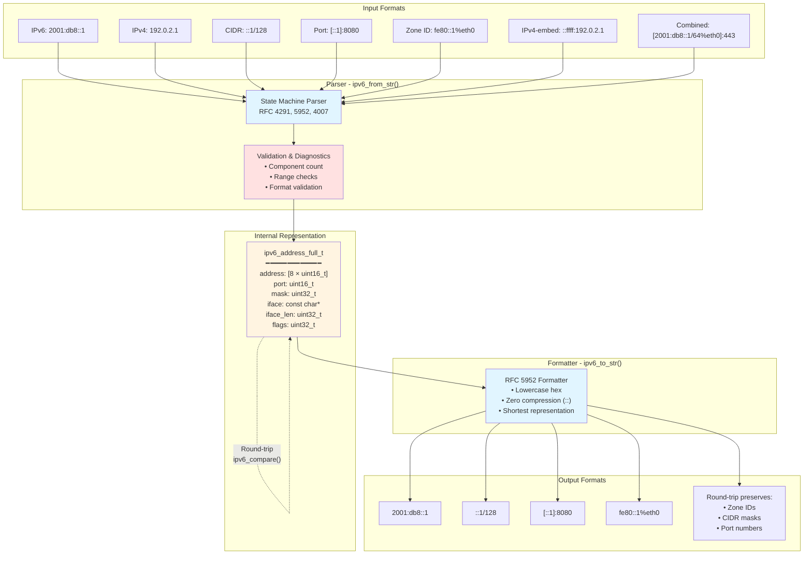

# IPv6 / IPv4 address parser in C

A self-contained embeddable address parsing library with full RFC compliance.

**Author**: jacobrepp@gmail.com | **License**: MIT

[](https://github.com/jrepp/ipv6-parse/actions/workflows/ci.yml)
[](https://codecov.io/gh/jrepp/ipv6-parse)
[](https://opensource.org/licenses/MIT)

---

## 🌐 Try it Live

**Interactive Web Demo:** [https://jrepp.github.io/ipv6-parse/](https://jrepp.github.io/ipv6-parse/)

Test IPv6/IPv4 address parsing in your browser with our modern WebAssembly-powered demo featuring:
- Real-time parsing and validation
- Batch testing mode with 60+ example addresses
- Visual error diagnostics with position indicators
- Zero dependencies, runs entirely in your browser

---

## Features

### Distribution Methods

Install however works best for your project:

- **[NPM Package](README_NPM.md)** - Node.js applications (async + sync APIs)
- **[WebAssembly](README_WASM.md)** - Browser applications ([live demo](https://jrepp.github.io/ipv6-parse/))
- **Linux Packages** - Debian/Ubuntu (.deb), Fedora/RHEL/CentOS (.rpm)
- **[Homebrew](README_PACKAGE_MANAGERS.md#homebrew)** - macOS and Linux
- **[Conan](README_PACKAGE_MANAGERS.md#conan)** - Cross-platform C/C++ projects
- **[vcpkg](README_PACKAGE_MANAGERS.md#vcpkg)** - Visual Studio and CMake projects
- **CMake Integration** - pkg-config support, find_package()
- **Source Code** - Single-header embedding in C/C++ projects

### Core Capabilities

**Full IPv6/IPv4 Support:**
- Zero compression: `::1`, `2001:db8::1`
- IPv4-embedded: `::ffff:192.0.2.1`
- CIDR notation: `2001:db8::/32`, `10.0.0.0/8`
- Port notation: `[::1]:8080`, `192.0.2.1:443`
- Zone IDs (RFC 4007): `fe80::1%eth0`
- IPv4 addresses: `192.0.2.1:8080`
- Shortened IPv4: `10.1` → `10.0.0.1`
- Complex combinations: `[2001:db8::1/64%eth0]:443`

**Quality & Reliability:**
- **RFC Compliant** - RFC 4291, RFC 5952, RFC 4007
- **Memory Safe** - No dynamic allocation, bounds checking
- **Round-trip Conversion** - Parse → Structure → String → Parse
- **Rich Diagnostics** - Detailed error reporting with position information
- **Comprehensive Tests** - 100+ test cases with fuzz testing
- **CI/CD Pipeline** - Multi-compiler testing (GCC, Clang, MSVC, AppleClang)
- **Cross-platform** - Linux, macOS, Windows

### Performance

Validated by comprehensive benchmarks on real hardware:

**Native C (Apple Silicon M-series):**
- Parsing: 3.6M operations/sec (0.28 μs/parse)
- Formatting: 3.3M operations/sec (0.30 μs/format)
- Comparison: 8.3M operations/sec (0.12 μs/compare)
- Overall: 4.3M operations/sec across all functions

**NPM/WASM (Browser/Node.js):**
- 1.75M+ parses/second, 570ns latency
- See [README_WASM.md](README_WASM.md#performance) for detailed benchmarks

Run your own benchmarks: `./build/bin/ipv6-fuzz 100000`

---

**Quick Links:** [RFC Conformance](#rfc-conformance) • [Quick Start](#quick-start) • [Installation](#installation) • [Overview](#overview) • [API Reference](#ipv6_from_str) • [Building](#building--debugging)

---

## RFC Conformance

This library implements the following IETF RFCs:

| RFC | Title | Implementation |
|-----|-------|----------------|
| [RFC 4291](https://www.rfc-editor.org/rfc/rfc4291.html) | **IPv6 Addressing Architecture** | ✅ Basic format, zero compression, IPv4 embedding, CIDR notation |
| [RFC 5952](https://www.rfc-editor.org/rfc/rfc5952.html) | **IPv6 Text Representation** | ✅ Lowercase hex, leading zero suppression, longest zero run compression |
| [RFC 4007](https://www.rfc-editor.org/rfc/rfc4007.html) | **IPv6 Scoped Address Architecture** | ✅ Zone identifiers with `%` delimiter, numeric and textual zone IDs |

### Quality Assurance

- ✅ **CI/CD Pipeline** - Multi-compiler testing (GCC 12-14, Clang 15-18, MSVC, AppleClang)
- ✅ **Code Coverage** - Tracked with lcov and Codecov
- ✅ **Memory Safety** - Valgrind testing for memory leaks
- ✅ **Warnings as Errors** - Strict compilation standards
- ✅ **Cross-platform** - Linux, macOS, Windows

## Quick Start

### C

```c
#include "ipv6.h"

const char *input = "[2001:db8::1/64]:8080";
ipv6_address_full_t addr = {0};

if (ipv6_from_str(input, strlen(input), &addr)) {
    printf("Port: %u, CIDR: %u\n", addr.port, addr.mask);

    char output[IPV6_STRING_SIZE];
    ipv6_to_str(&addr, output, sizeof(output));
    printf("Formatted: %s\n", output);
}
```

### JavaScript

```javascript
import { parse, isValid } from 'ipv6-parse';

// Parse and destructure
const { formatted, port, mask } = await parse('[2001:db8::1/64]:8080');
console.log({ formatted, port, mask });  // { formatted: "2001:db8::1", port: 8080, mask: 64 }

// Validate and handle errors
const input = userInput.trim();
if (await isValid(input)) {
    const addr = await parse(input);
    // Use addr.formatted, addr.components, etc.
}
```

**High-performance sync API:** See [README_NPM.md](README_NPM.md) for 1.75M+ ops/sec synchronous parsing.

**Browser usage:** See [README_WASM.md](README_WASM.md) for WebAssembly integration.

## Installation

### NPM (Node.js)

```bash
npm install ipv6-parse
```

```javascript
const ipv6 = require('ipv6-parse');

const addr = await ipv6.parse('2001:db8::1');
console.log(addr.formatted);  // "2001:db8::1"
```

See [README_NPM.md](README_NPM.md) for complete NPM documentation.

### WebAssembly (Browser)

Download the [latest WASM release](https://github.com/jrepp/ipv6-parse/releases) or try the [interactive demo](https://jrepp.github.io/ipv6-parse/).

```html
<script src="ipv6-parse.js"></script>
<script src="ipv6-parse-api.js"></script>
<script>
createIPv6Module().then(module => {
    const parser = new IPv6Parser(module);
    const addr = parser.parse('2001:db8::1');
    console.log(addr.formatted);
});
</script>
```

See [README_WASM.md](README_WASM.md) for complete WASM documentation.

### Linux Packages

**Debian/Ubuntu:**
```bash
# Download from releases page
wget https://github.com/jrepp/ipv6-parse/releases/latest/download/ipv6-parse-*-Linux.deb
sudo dpkg -i ipv6-parse-*-Linux.deb
```

**Fedora/RHEL/CentOS:**
```bash
# Download from releases page
wget https://github.com/jrepp/ipv6-parse/releases/latest/download/ipv6-parse-*-Linux.rpm
sudo rpm -i ipv6-parse-*-Linux.rpm
```

### Homebrew (macOS/Linux)

```bash
# Install from HEAD (latest master)
brew install --HEAD https://raw.githubusercontent.com/jrepp/ipv6-parse/master/Formula/ipv6-parse.rb
```

Optional: Build with WASM support:
```bash
brew install ipv6-parse --with-emscripten
```

### Conan (Cross-platform C/C++)

```bash
# Add to your conanfile.txt
[requires]
ipv6-parse/1.2.1

# Or install directly
conan create . ipv6-parse/1.2.1@
```

### vcpkg (Cross-platform C/C++)

```bash
# After copying port to vcpkg/ports/ipv6-parse
vcpkg install ipv6-parse
```

See [README_PACKAGE_MANAGERS.md](README_PACKAGE_MANAGERS.md) for complete package manager documentation.

### Building from Source

**Static library (default):**
```bash
mkdir build && cd build
cmake ..
make
sudo make install
```

**Shared library:**
```bash
mkdir build && cd build
cmake -DBUILD_SHARED_LIBS=ON ..
make
sudo make install
```

**WebAssembly:**
```bash
# Requires Emscripten SDK
./build_wasm.sh
```

After installation, the library can be used with:
- **pkg-config**: `gcc $(pkg-config --cflags --libs ipv6-parse) myapp.c -o myapp`
- **CMake**: `find_package(ipv6-parse REQUIRED)` and `target_link_libraries(myapp PRIVATE ipv6-parse::ipv6-parse)`

## Overview



## RFC 4007 Scoped IPv6 Addresses

This library implements [RFC 4007](https://www.rfc-editor.org/rfc/rfc4007.html) for IPv6 scoped addresses with zone identifiers (zone IDs). Zone IDs are used to identify the zone (typically a network interface) for addresses with non-global scope, such as link-local addresses.

### Format

Zone IDs use the `%` delimiter followed by an implementation-dependent zone identifier:

```
<address>%<zone_id>
```

### Examples

```c
ipv6_address_full_t addr;

// Link-local address with interface name
ipv6_from_str("fe80::1%eth0", 15, &addr);

// Numeric zone ID
ipv6_from_str("fe80::1%1", 10, &addr);

// Zone ID with CIDR notation
ipv6_from_str("fe80::1/64%eth0", 18, &addr);

// Zone ID with port notation (brackets required)
ipv6_from_str("[fe80::1%eth0]:8080", 22, &addr);

// Access zone ID from parsed address
printf("Interface: %.*s\n", addr.iface_len, addr.iface);

// Round-trip conversion preserves zone ID
char output[IPV6_STRING_SIZE];
ipv6_to_str(&addr, output, sizeof(output));
// Result: "fe80::1%eth0"
```

### Conformance

- **MUST** use `%` as delimiter (Section 11.2)
- **MUST** validate interface name length < 16 characters (IFNAMSIZ)
- **MAY** be used with any scoped address, not just link-local (Section 6)
- Zone IDs are **implementation-dependent** (numeric or textual)
- Full compatibility with bracket notation for ports (Section 11.7)
- Supports combination with CIDR masks

### Structure Fields

The `ipv6_address_full_t` structure includes zone ID support:

```c
typedef struct {
    ipv6_address_t          address;        // address components
    uint16_t                port;           // port binding
    uint16_t                pad0;           // first padding
    uint32_t                mask;           // CIDR mask bits
    const char*             iface;          // pointer to zone ID in input string
    uint32_t                iface_len;      // length of zone ID string
    uint32_t                flags;          // feature flags
} ipv6_address_full_t;
```

**Note:** The `iface` pointer references the original input string. Ensure the input string remains valid while accessing the zone ID.

## IPv4 Compatibility Mode

See test.c: test_api_use_loopback_const
```c
    127.111.2.1
    uint16_t components[IPV6_NUM_COMPONENTS] = {
        0x7f6f,
        0x0201 }
```

- Addresses can be constructed directly in code and support the full two-way functionality


## Building / Debugging

Full tracing can be enabled by running `cmake -DPARSE_TRACE=1`


### ipv6_flag_t

Flags are used to communicate which fields are filled out in the address structure
after parsing. Address components are assumed.

```c
typedef enum {
    IPV6_FLAG_HAS_PORT      = 0x00000001,   // the address specifies a port setting
    IPV6_FLAG_HAS_MASK      = 0x00000002,   // the address specifies a CIDR mask
    IPV6_FLAG_IPV4_EMBED    = 0x00000004,   // the address has an embedded IPv4 address in the last 32bits
    IPV6_FLAG_IPV4_COMPAT   = 0x00000008,   // the address is IPv4 compatible (1.2.3.4:5555)
} ipv6_flag_t;
```

### ipv6_address_t

Simplified address structure where the components are represented in
machine format, left to right [0..7]

e.g. little-endian x86 machines:

     aa11:bb22:: -> 0xaa11, 0xbb22, 0x0000, ...

```c
#define IPV6_NUM_COMPONENTS 8
#define IPV4_NUM_COMPONENTS 2
#define IPV4_EMBED_INDEX 6
typedef struct {
    uint16_t                components[IPV6_NUM_COMPONENTS];
} ipv6_address_t;
```
*ipv6_address_full_t*

Input / output type for round trip parsing and converting to string.

Features are indicated using flags, see *ipv6_flag_t*.

```c
typedef struct {
    ipv6_address_t          address;        // address components
    uint16_t                port;           // port binding
    uint16_t                pad0;           // first padding
    uint32_t                mask;           // number of mask bits N specified for example in ::1/N
    const char*             iface;          // pointer to place in address string where interface is defined
    uint32_t                iface_len;      // number of bytes in the name of the interface
    uint32_t                flags;          // flags indicating features of address
} ipv6_address_full_t;
```

### ipv6_compare_t

Result of ipv6_compare of two addresses

```c
typedef enum {
    IPV6_COMPARE_OK = 0,
    IPV6_COMPARE_FORMAT_MISMATCH,       // address differ in their
    IPV6_COMPARE_MASK_MISMATCH,         // the CIDR mask does not match
    IPV6_COMPARE_PORT_MISMATCH,         // the port does not match
    IPV6_COMPARE_ADDRESS_MISMATCH,      // address components do not match
} ipv6_compare_result_t;
```

### ipv6_diag_event_t

Event type emitted from diagnostic function

```c
typedef enum {
    IPV6_DIAG_STRING_SIZE_EXCEEDED          = 0,
    IPV6_DIAG_INVALID_INPUT                 = 1,
    IPV6_DIAG_INVALID_INPUT_CHAR            = 2,
    IPV6_DIAG_TRAILING_ZEROES               = 3,
    IPV6_DIAG_V6_BAD_COMPONENT_COUNT        = 4,
    IPV6_DIAG_V4_BAD_COMPONENT_COUNT        = 5,
    IPV6_DIAG_V6_COMPONENT_OUT_OF_RANGE     = 6,
    IPV6_DIAG_V4_COMPONENT_OUT_OF_RANGE     = 7,
    IPV6_DIAG_INVALID_PORT                  = 8,
    IPV6_DIAG_INVALID_CIDR_MASK             = 9,
    IPV6_DIAG_IPV4_REQUIRED_BITS            = 10,
    IPV6_DIAG_IPV4_INCORRECT_POSITION       = 11,
    IPV6_DIAG_INVALID_BRACKETS              = 12,
    IPV6_DIAG_INVALID_ABBREV                = 13,
    IPV6_DIAG_INVALID_DECIMAL_TOKEN         = 14,
    IPV6_DIAG_INVALID_HEX_TOKEN             = 15,
} ipv6_diag_event_t;
```

### ipv6_diag_info_t

Structure that carriers information about the diagnostic message

```c
typedef struct {
    const char* message;    // English ascii debug message
    const char* input;      // Input string that generated the diagnostic
    uint32_t    position;   // Position in input that caused the diagnostic
    uint32_t    pad0;
} ipv6_diag_info_t;
```

### ipv6_diag_func_t

A diagnostic function that receives information from parsing the address

```c
typedef void (*ipv6_diag_func_t) (
    ipv6_diag_event_t event,
    const ipv6_diag_info_t* info,
    void* user_data);
```

### ipv6_from_str

Read an IPv6 address from a string, handles parsing a variety of format
information from the spec. Will also handle IPv4 address passed in without
any embedding information.

```c
bool IPV6_API_DECL(ipv6_from_str) (
    const char* input,
    size_t input_bytes,
    ipv6_address_full_t* out);
```

### ipv6_from_str_diag

Additional functionality parser that receives diagnostics information from parsing the address,
including errors.

```c
bool IPV6_API_DECL(ipv6_from_str_diag) (
    const char* input,
    size_t input_bytes,
    ipv6_address_full_t* out,
    ipv6_diag_func_t func,
    void* user_data);
```

### ipv6_to_str

Convert an IPv6 structure to an ASCII string.

The conversion will flatten zero address components according to the address
formatting specification. For example: ffff:0:0:0:0:0:0:1 -> ffff::1

Requires output_bytes
Returns the size in bytes of the string minus the nul byte.

```c
size_t IPV6_API_DECL(ipv6_to_str) (
    const ipv6_address_full_t* in,
    char* output,
    size_t output_bytes);
```

### ipv6_compare

Compare two addresses, 0 (IPV6_COMPARE_OK) if equal, else ipv6_compare_result_t.

Use IPV6_FLAG_HAS_MASK, IPV6_FLAG_HAS_PORT in ignore_flags to
ignore mask or port in comparisons.

IPv4 embed and IPv4 compatible addresses will be compared as
equal if either IPV6_FLAG_IPV4_EMBED or IPV6_FLAG_IPV4_COMPAT
flags are passed in ignore_flags.

```c
ipv6_compare_result_t IPV6_API_DECL(ipv6_compare) (
    const ipv6_address_full_t* a,
    const ipv6_address_full_t* b,
    uint32_t ignore_flags);
```
