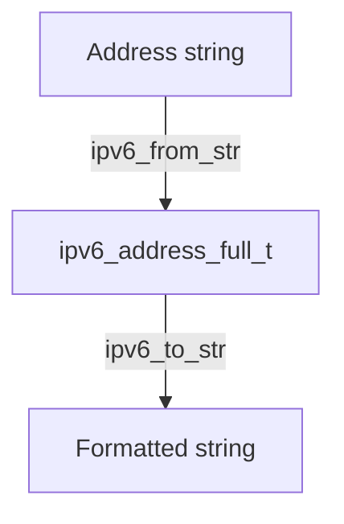

# IPv6 / IPv4 address parser in C

A small C library for parsing, formatting, and comparing IP addresses, with no
dynamic allocation. Supports IPv6 and IPv4, CIDR masks, ports, zone IDs, and
IPv4 embedded in IPv6. JavaScript bindings are available through WebAssembly.

[](https://github.com/jrepp/ipv6-parse/actions/workflows/ci.yml?query=branch%3Amain)
[](https://codecov.io/gh/jrepp/ipv6-parse)

[Try it in your browser](https://jrepp.github.io/ipv6-parse/) ·
[IPv6 introduction](https://jrepp.github.io/ipv6-parse/guide.html) ·
[Releases](https://github.com/jrepp/ipv6-parse/releases)

## Usage

The parser reads an address into a structure. The formatter converts it back to
text, including any IPv6 mask, zone ID, or port.


```mermaid
flowchart TD
    input["Address string"] -->|ipv6_from_str| address["ipv6_address_full_t"]
    address -->|ipv6_to_str| output["Formatted string"]
```

```c
#include "ipv6.h"
#include <stdio.h>
#include <string.h>

int main(void) {
    const char *input = "[2001:db8::1/64]:8080";
    ipv6_address_full_t addr = {0};
    char output[IPV6_STRING_SIZE];

    if (!ipv6_from_str(input, strlen(input), &addr)) {
        return 1;
    }

    ipv6_to_str(&addr, output, sizeof(output));
    puts(output);  // [2001:db8::1/64]:8080
    return 0;
}
```

Zone IDs reference the original input string; keep it alive while using the
parsed address. See the [C API reference](https://jrepp.github.io/ipv6-parse/c-api.html)
for diagnostics, field flags, and comparison options.

## Build

Requires CMake and a C/C++ toolchain. From the repository root:

```sh
cmake -S . -B build
cmake --build build --config Release
cmake --install build --config Release
```

This builds a static library by default. Use `-DBUILD_SHARED_LIBS=ON` for a shared
library. The [installation guide](https://jrepp.github.io/ipv6-parse/c-api.html#installation)
covers CMake integration, pkg-config, and package managers.

## JavaScript

```sh
npm install ipv6-parse
```

```javascript
const ipv6 = require('ipv6-parse');

async function main() {
    const addr = await ipv6.parse('2001:db8::1');
    console.log(addr.formatted); // 2001:db8::1
}

main().catch(console.error);
```

See the [JavaScript guide](https://jrepp.github.io/ipv6-parse/javascript.html)
for synchronous parsing and browser usage, or the
[TypeScript guide](https://jrepp.github.io/ipv6-parse/typescript.html) for typed examples.

## Development

To build and run the native tests:

```sh
cmake -S . -B build -DIPV6_PARSE_LIBRARY_ONLY=OFF
cmake --build build --config Release
ctest --test-dir build --build-config Release --output-on-failure
```

[Contributing](CONTRIBUTING.md) ·
[Testing and benchmarks](https://jrepp.github.io/ipv6-parse/development.html) ·
[MIT license](LICENSE)
