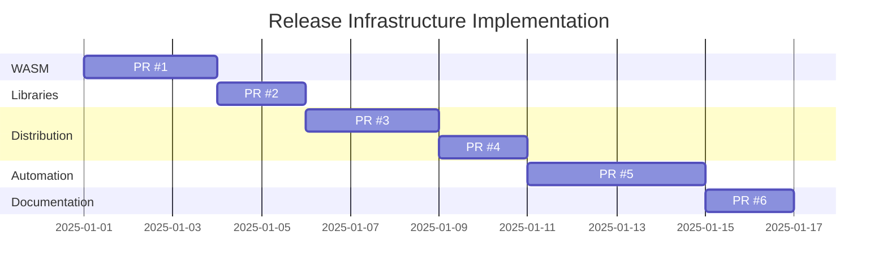

# Release Build Infrastructure Roadmap

This document outlines the plan to add comprehensive build and release infrastructure to ipv6-parse.

## Goals

1. **WebAssembly Support** - Enable browser-based IPv6 parsing
2. **Native Libraries** - Build static and shared libraries for all platforms
3. **Package Distribution** - Distribute via deb, rpm, and npm
4. **Automated Releases** - CI/CD pipeline for automatic releases
5. **GitHub Pages Demo** - Interactive demo site

## PR Strategy

To maintain code quality and ease review, this work will be split into multiple focused PRs:

### PR #1: WebAssembly Build Support ✅ (CURRENT)

**Branch**: `wasm-build-target`

**Files Added**:
- `cmake/emscripten.cmake` - Emscripten CMake toolchain
- `ipv6_wasm.c` - WASM-specific C bindings
- `build_wasm.sh` - Build script for WASM
- `docs/index.html` - Interactive demo page
- `docs/ipv6-parse.js` - (Generated by build)
- `README_WASM.md` - WASM documentation

**Description**:
Adds WebAssembly build target using Emscripten, enabling ipv6-parse to run in web browsers. Includes an interactive demo page inspired by v6decode.com for testing IPv6 addresses.

**Testing**:
1. Install Emscripten SDK
2. Run `./build_wasm.sh`
3. Test locally: `python3 -m http.server --directory docs`
4. Open http://localhost:8000

**Benefits**:
- No server-side processing required for IPv6 parsing
- Interactive testing interface
- Foundation for GitHub Pages deployment

---

### PR #2: Shared Library Support

**Branch**: `shared-library-support` (future)

**Changes**:
- Update `CMakeLists.txt` to build both static and shared libraries
- Add library versioning (SONAME)
- Create pkg-config `.pc` file for library discovery
- Update installation targets

**Files Modified**:
- `CMakeLists.txt`

**Files Added**:
- `ipv6-parse.pc.in` - pkg-config template

**Description**:
Extends CMake configuration to build shared libraries (`.so`, `.dylib`, `.dll`) in addition to static libraries, with proper versioning and pkg-config support.

**Testing**:
```bash
mkdir build && cd build
cmake -DBUILD_SHARED_LIBS=ON ..
make
sudo make install
pkg-config --cflags --libs ipv6-parse
```

---

### PR #3: NPM Package

**Branch**: `npm-package` (future)

**Files Added**:
- `package.json` - NPM package configuration
- `.npmignore` - Files to exclude from NPM
- `binding.gyp` - Node.js native module build config (alternative to WASM)
- `index.js` - Node.js entry point
- `README_NPM.md` - NPM-specific documentation

**Description**:
Creates an NPM package for Node.js applications, providing both WASM and native bindings (via node-gyp) for optimal performance.

**Package Features**:
- Dual WASM/native support (WASM for portability, native for performance)
- TypeScript definitions
- Zero dependencies (for WASM version)
- CommonJS and ESM support

**Testing**:
```bash
npm pack
npm install ./ipv6-parse-1.2.1.tgz
node -e "const ipv6 = require('ipv6-parse'); console.log(ipv6.parse('::1'))"
```

**Publishing**:
```bash
npm publish
```

---

### PR #4: Linux Package Distribution (deb/rpm)

**Branch**: `linux-packages` (future)

**Changes**:
- Add CPack configuration to `CMakeLists.txt`
- Create Debian package metadata
- Create RPM spec file

**Files Added**:
- `debian/control` - Debian package metadata
- `debian/copyright` - License information
- `debian/changelog` - Package changelog
- `ipv6-parse.spec` - RPM spec file

**Files Modified**:
- `CMakeLists.txt` - Add CPack configuration

**Description**:
Adds CPack configuration to generate native Linux packages (deb for Debian/Ubuntu, rpm for Fedora/RHEL).

**Package Contents**:
- Runtime library: `libipv6-parse.so.1.2.1`
- Development files: `libipv6-parse-dev`
- Headers: `/usr/include/ipv6.h`
- pkg-config: `/usr/lib/pkgconfig/ipv6-parse.pc`

**Testing**:
```bash
# Build packages
mkdir build && cd build
cmake -DCPACK_GENERATOR="DEB;RPM" ..
make package

# Install and test
sudo dpkg -i ipv6-parse-1.2.1-Linux.deb
sudo rpm -i ipv6-parse-1.2.1-Linux.rpm
```

---

### PR #5: GitHub Actions Release Pipeline

**Branch**: `release-automation` (future)

**Files Added**:
- `.github/workflows/release.yml` - Release workflow
- `.github/workflows/build-matrix.yml` - Multi-platform build matrix
- `scripts/prepare-release.sh` - Release preparation script
- `scripts/build-packages.sh` - Package build script

**Description**:
Implements automated release pipeline using GitHub Actions that:

1. **Triggered on**:
   - Git tags matching `v*.*.*`
   - Manual workflow dispatch

2. **Build matrix**:
   - **Linux**: Ubuntu 20.04, 22.04 (gcc, clang)
   - **macOS**: Latest (AppleClang)
   - **Windows**: Latest (MSVC)
   - **WASM**: Emscripten latest

3. **Artifacts generated**:
   - Static libraries (`.a`, `.lib`)
   - Shared libraries (`.so`, `.dylib`, `.dll`)
   - WASM module (`ipv6-parse.js`)
   - Linux packages (`.deb`, `.rpm`)
   - Source tarball

4. **Publish**:
   - GitHub Release with all artifacts
   - NPM package (if version tag)
   - Update GitHub Pages (WASM demo)

**Workflow Steps**:
```yaml
1. Checkout code
2. Set up build environment
3. Run tests
4. Build for platform
5. Generate packages
6. Upload artifacts
7. Create GitHub Release
8. Publish to NPM (if tag)
9. Deploy to GitHub Pages
```

**Testing**:
```bash
# Test locally with act
act -j release

# Or create a test tag
git tag v1.2.1-rc1
git push origin v1.2.1-rc1
```

---

### PR #6: Documentation Updates

**Branch**: `documentation-updates` (future)

**Files Modified**:
- `README.md` - Add build/install instructions for all platforms

**Files Added**:
- `docs/BUILDING.md` - Comprehensive build guide
- `docs/PACKAGING.md` - Package maintainer guide
- `docs/RELEASING.md` - Release process guide

**Description**:
Updates all documentation to reflect new build options, installation methods, and package availability.

**Sections to Add**:
- Installation instructions (npm, apt, yum, homebrew)
- Building from source (all platforms)
- Cross-compilation guide
- Package maintainer documentation
- Release checklist

---

## Implementation Timeline



## Dependencies

- **PR #1** → Independent (can merge first)
- **PR #2** → Independent (can merge in any order)
- **PR #3** → Depends on PR #1 (needs WASM build)
- **PR #4** → Depends on PR #2 (needs shared library)
- **PR #5** → Depends on PR #1-4 (needs all build targets)
- **PR #6** → Depends on PR #1-5 (documents everything)

## Deployment Plan

### Phase 1: WASM (Immediate)
1. Merge PR #1
2. Enable GitHub Pages on `master` branch, `/docs` folder
3. Demo available at https://jrepp.github.io/ipv6-parse/

### Phase 2: Native Libraries (Week 1)
1. Merge PR #2
2. Users can build shared libraries locally

### Phase 3: Package Distribution (Week 2)
1. Merge PR #3 and #4
2. First manual release with packages
3. Publish initial NPM package

### Phase 4: Automation (Week 3)
1. Merge PR #5
2. Create `v1.3.0` tag
3. Automated release with all artifacts

### Phase 5: Documentation (Week 4)
1. Merge PR #6
2. Announce v1.3.0 release with full feature set

## Version Strategy

- **v1.2.1** (current) - Base library
- **v1.3.0** - WASM support + shared libraries
- **v1.4.0** - Package distribution (npm, deb, rpm)
- **v1.5.0** - Full CI/CD automation

## Success Metrics

1. ✅ WASM demo accessible via GitHub Pages
2. ⬜ Package available on NPM
3. ⬜ Packages available on Ubuntu/Debian (via PPA or direct download)
4. ⬜ Packages available on Fedora/RHEL (via COPR or direct download)
5. ⬜ Automated releases on every tag
6. ⬜ Multi-platform CI testing

## Questions & Discussion

### Should we support Homebrew?

Yes, but as a future enhancement. Creating a Homebrew formula is straightforward once we have stable releases.

```ruby
# ipv6-parse.rb (future)
class Ipv6Parse < Formula
  desc "IPv6/IPv4 address parser with full RFC compliance"
  homepage "https://github.com/jrepp/ipv6-parse"
  url "https://github.com/jrepp/ipv6-parse/archive/v1.3.0.tar.gz"
  sha256 "..."
  license "MIT"

  depends_on "cmake" => :build

  def install
    system "cmake", ".", *std_cmake_args
    system "make", "install"
  end

  test do
    # Add test
  end
end
```

### Should we support Conan?

Potentially, as it's popular for C++ projects. This would be PR #7.

### Should we publish to vcpkg?

Yes, vcpkg is very popular for Windows/Visual Studio users. This would be PR #8.

## Current Status

- ✅ **PR #1 (WASM)**: Ready for review
- ⬜ **PR #2-6**: Planned, not started

## Next Steps

1. Review and merge PR #1 (WASM build)
2. Test GitHub Pages deployment
3. Start PR #2 (shared libraries)
4. Gather feedback on package formats

## Contributing

Feedback on this roadmap is welcome! Please open an issue or PR to suggest changes.
